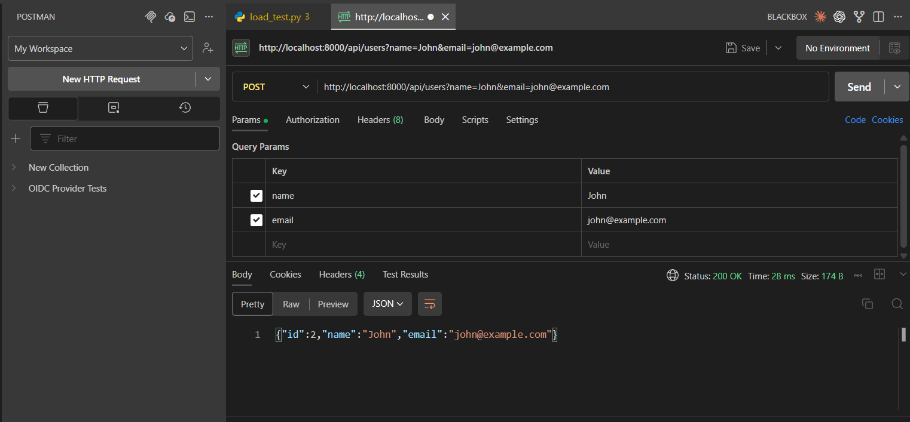
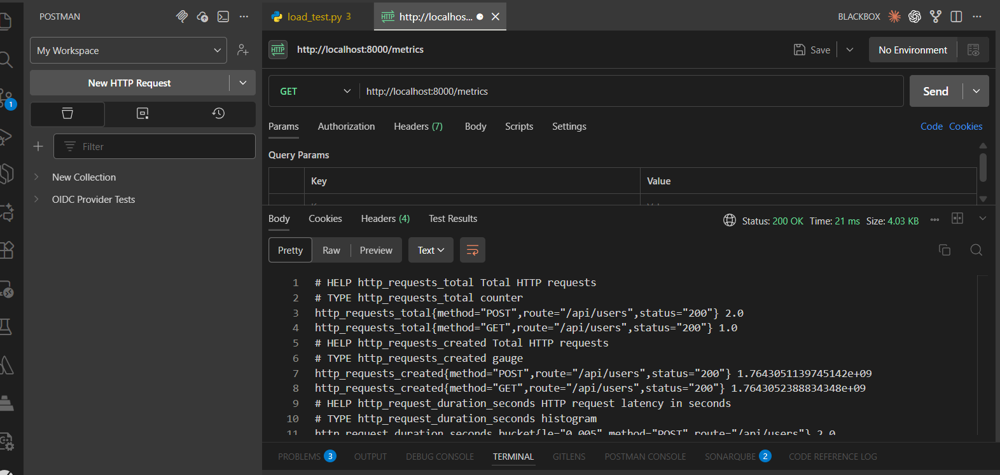

# REST API Monitoring with Prometheus & Grafana

A production-ready, fully containerized monitoring system demonstrating comprehensive application-level metrics collection using Prometheus and visualization through Grafana dashboards.

## 🎯 Project Overview

This project implements a complete observability stack for REST APIs, tracking key performance indicators, request patterns, and application health in real-time using the RED method (Rate, Errors, Duration).

### Architecture

```
┌──────────────────────┐
│   FastAPI REST API   │
│   (Port 8000)        │
│  • CRUD endpoints    │
│  • Health check      │
│  • /metrics endpoint │
└──────────┬───────────┘
           │ (exposes /metrics)
           ↓
┌──────────────────────┐
│   Prometheus         │
│   (Port 9090)        │
│  • Scrapes every 15s │
│  • Time-series DB    │
│  • 15-day retention  │
└──────────┬──���────────┘
           │ (queries data)
           ↓
┌──────────────────────┐
│   Grafana            │
│   (Port 3000)        │
│  • Professional      │
│    dashboards        │
│  • Real-time viz     │
└──────────────────────┘
```

## 🛠️ Tech Stack

- **API Framework**: FastAPI with Python 3.9+
- **Metrics Collection**: Prometheus client library
- **Metrics Storage**: Prometheus server
- **Visualization**: Grafana
- **Containerization**: Docker & Docker Compose
- **Networking**: Docker bridge network for inter-service communication

## 📋 Project Structure

```
monitoring-system-clone/
├── api/
│   ├── main.py                    # FastAPI application with endpoints
│   ├── requirements.txt           # Python dependencies
│   ├── Dockerfile                 # API container configuration
│   ├── models/
│   │   └── metrics_model.py       # Prometheus metrics definitions
│   ├── controllers/
│   │   └── metrics_controller.py  # Business logic & metrics recording
│   └── views/
│       └── metrics_view.py        # Response formatting
├── prometheus/
│   ├─��� prometheus.yml             # Prometheus configuration
│   └── Dockerfile                 # Prometheus container
├── grafana/
│   ├── Dockerfile                 # Grafana container
│   └── provisioning/
│       ├── datasources/
│       │   └── datasource.yml     # Auto-configured Prometheus DS
│       └── dashboards/
│           └── main-dashboard.json # Pre-built monitoring dashboard
├── docker-compose.yml             # Multi-container orchestration
└── README.md                       # This file
```

## 🚀 Quick Start

### Prerequisites

- Docker 20.10+
- Docker Compose 1.29+
- Ports 8000, 9090, 3000 available

### Deploy

```bash
# Navigate to project directory
cd monitoring-system-clone

# Start all services
docker-compose up -d

# Verify services are running
docker-compose ps

# View logs
docker-compose logs -f
```

All three services will start in the background:

| Service | URL | Purpose |
|---------|-----|---------|
| **API** | http://localhost:8000 | REST API with metrics endpoint |
| **Prometheus** | http://localhost:9090 | Metrics scraping & querying |
| **Grafana** | http://localhost:3000 | Dashboards & visualization |

**Grafana Credentials**: `admin` / `admin`

## 📊 Metrics Tracked

### HTTP Request Metrics

- **`http_requests_total`** - Counter of total HTTP requests
  - Labels: `method`, `route`, `status`
  - Tracks all requests by HTTP method, endpoint, and response status

- **`http_request_duration_seconds`** - Histogram of request latency
  - Labels: `method`, `route`
  - Buckets: 5ms, 10ms, 25ms, 50ms, 100ms, 250ms, 500ms, 1s, 2.5s, 5s, 10s
  - Enables percentile calculations (P50, P95, P99)

- **`http_requests_in_progress`** - Gauge of active requests
  - Labels: `method`, `route`
  - Real-time count of requests being processed

### Error Metrics

- **`api_errors_total`** - Counter of API errors
  - Labels: `error_type`
  - Tracks errors by exception type

### Legacy Metrics (Backward Compatible)

- `app_requests_total` - Total API requests
- `app_active_users` - Active user count
- `app_cpu_usage_percent` - Simulated CPU usage

## 🔌 API Endpoints

### Health & Metrics

| Endpoint | Method | Description |
|----------|--------|-------------|
| `/health` | GET | Health check endpoint |
| `/metrics` | GET | Prometheus metrics in text format |

### User Management (CRUD)

| Endpoint | Method | Query Params | Description |
|----------|--------|------------|-------------|
| `/api/users` | GET | — | List all users |
| `/api/users/{id}` | GET | — | Get user by ID |
| `/api/users` | POST | `name`, `email` | Create new user |
| `/api/users/{id}` | PUT | `name`, `email` | Update user |
| `/api/users/{id}` | DELETE | — | Delete user |

### Testing Endpoints

| Endpoint | Method | Description |
|----------|--------|-------------|
| `/api/slow` | GET | Simulated slow endpoint (2-3s delay) |
| `/api/error` | GET | Simulated error endpoint (500 error) |

### Legacy Endpoints

| Endpoint | Method | Query Params | Description |
|----------|--------|------------|-------------|
| `/update` | GET | `users` (int ≥ 0) | Update active user count |
| `/cpu` | GET | `value` (float 0–100) | Update CPU usage percentage |

## 📈 Usage Examples

### Generate Traffic

```bash
# Create users
curl -X POST "http://localhost:8000/api/users?name=John&email=john@example.com"
curl -X POST "http://localhost:8000/api/users?name=Jane&email=jane@example.com"

# List users
curl http://localhost:8000/api/users

# Get specific user
curl http://localhost:8000/api/users/1

# Update user
curl -X PUT "http://localhost:8000/api/users/1?name=John%20Doe"

# Delete user
curl -X DELETE http://localhost:8000/api/users/1

# Test slow endpoint
curl http://localhost:8000/api/slow

# Test error endpoint
curl http://localhost:8000/api/error

# View raw metrics
curl http://localhost:8000/metrics
```

### Load Testing

```bash
# Using Apache Bench (if installed)
ab -n 1000 -c 10 http://localhost:8000/api/users

# Or using curl in a loop
for i in {1..100}; do
  curl -X POST "http://localhost:8000/api/users?name=User$i&email=user$i@example.com" &
done
wait
```

## 📊 Grafana Dashboard

The pre-configured dashboard includes 8 professional panels:

### 1. **Request Rate (5m)**
- Time-series graph showing requests per second
- Color-coded by method and route
- Helps identify traffic patterns

### 2. **Active Requests**
- Gauge showing current in-progress requests
- Color thresholds: Green (<2), Yellow (2-5), Red (>5)
- Indicates system load

### 3. **Latency Percentiles (P50, P95, P99)**
- Multi-line graph showing response time percentiles
- Identifies performance degradation
- Helps set SLOs

### 4. **Error Rate (5m)**
- Percentage of failed requests over time
- Color thresholds: Green (<2%), Yellow (2-5%), Red (>5%)
- Critical for SLA monitoring

### 5. **Requests by Status Code**
- Stacked bar chart showing distribution of HTTP status codes
- Separates successful (2xx), redirects (3xx), client errors (4xx), server errors (5xx)

### 6. **Errors by Type**
- Line graph showing error frequency by exception type
- Helps identify error patterns

### 7. **Request Distribution by Endpoint**
- Pie chart showing traffic distribution across endpoints
- Identifies most-used endpoints

### 8. **Average Response Time by Endpoint**
- Bar chart showing average latency per endpoint
- Identifies slow endpoints for optimization

## 🔍 Key Prometheus Queries

```promql
# Request rate (requests per second)
rate(http_requests_total[5m])

# P95 latency
histogram_quantile(0.95, rate(http_request_duration_seconds_bucket[5m]))

# Error rate percentage
(rate(http_requests_total{status=~"5.."}[5m]) / rate(http_requests_total[5m])) * 100

# Requests by endpoint
sum by (route) (rate(http_requests_total[5m]))

# Average response time
rate(http_request_duration_seconds_sum[5m]) / rate(http_request_duration_seconds_count[5m])

# Active requests
http_requests_in_progress

# Errors by type
rate(api_errors_total[5m])
```

## 🔧 Configuration

### Prometheus (`prometheus/prometheus.yml`)

```yaml
global:
  scrape_interval: 15s      # Scrape every 15 seconds
  evaluation_interval: 15s  # Evaluate rules every 15 seconds

scrape_configs:
  - job_name: "api"
    metrics_path: "/metrics"
    static_configs:
      - targets: ["api:8000"]
```

**Key Settings:**
- Scrape interval: 15 seconds (balance between freshness and load)
- Retention: 15 days of data
- Target: API service at `api:8000/metrics`

### Grafana (`grafana/provisioning/datasources/datasource.yml`)

Auto-provisioned Prometheus data source:
- URL: `http://prometheus:9090`
- Set as default data source
- No authentication (internal network)

## 🐳 Docker Compose Configuration

### Services

1. **API Service**
   - Container: `api-monitoring`
   - Port: 8000
   - Health check: `/health` endpoint
   - Network: `monitoring`

2. **Prometheus Service**
   - Container: `prometheus-monitoring`
   - Port: 9090
   - Volumes: Configuration and data persistence
   - Health check: `/-/healthy` endpoint
   - Depends on: API (healthy)

3. **Grafana Service**
   - Container: `grafana-monitoring`
   - Port: 3000
   - Volumes: Provisioning and data persistence
   - Health check: `/api/health` endpoint
   - Depends on: Prometheus (healthy)

### Networks & Volumes

- **Network**: `monitoring` bridge network for inter-service communication
- **Volumes**:
  - `prometheus_data`: Persistent Prometheus time-series database
  - `grafana_data`: Persistent Grafana configuration and dashboards

## 🛑 Stopping & Cleanup

### Stop All Services

```bash
docker-compose down
```

### Stop + Remove Volumes (Clean Slate)

```bash
docker-compose down -v
```

### View Logs

```bash
# All services
docker-compose logs -f

# Specific service
docker-compose logs -f api
docker-compose logs -f prometheus
docker-compose logs -f grafana

# Last 100 lines
docker-compose logs --tail=100 api
```

### Rebuild Containers

```bash
docker-compose down
docker-compose build --no-cache
docker-compose up -d
```

## 🐛 Troubleshooting

### API Not Responding

```bash
docker-compose logs api
```

Check for Python import errors or dependency issues. Verify the API is listening on port 8000.

### Prometheus Can't Scrape API

1. Visit http://localhost:9090/targets
2. Check if the API target shows "UP" status
3. If "DOWN", verify:
   - API container is running: `docker-compose ps`
   - API is healthy: `curl http://localhost:8000/health`
   - Network connectivity: `docker-compose exec prometheus ping api`

### Grafana Can't Connect to Prometheus

1. Go to Grafana Settings (⚙️ → Data Sources)
2. Check Prometheus data source configuration
3. Verify URL is `http://prometheus:9090`
4. Click "Test" to verify connection

### Metrics Not Appearing

1. Generate traffic: `curl http://localhost:8000/api/users`
2. Wait 15-30 seconds for Prometheus to scrape
3. Check raw metrics: `curl http://localhost:8000/metrics`
4. Query in Prometheus: http://localhost:9090/graph

### Container Won't Start

```bash
# Check specific error
docker-compose logs <service_name>

# Rebuild and restart
docker-compose down
docker-compose build --no-cache
docker-compose up -d
```

## 📚 Understanding the Metrics

### RED Method (Rate, Errors, Duration)

This project implements the RED method for monitoring:

1. **Rate**: How many requests per second?
   - Query: `rate(http_requests_total[5m])`
   - Panel: "Request Rate (5m)"

2. **Errors**: How many of those requests are failing?
   - Query: `(rate(http_requests_total{status=~"5.."}[5m]) / rate(http_requests_total[5m])) * 100`
   - Panel: "Error Rate (5m)"

3. **Duration**: How long do requests take?
   - Query: `histogram_quantile(0.95, rate(http_request_duration_seconds_bucket[5m]))`
   - Panel: "Latency Percentiles"

### Histogram Buckets

The request duration histogram uses these buckets (in seconds):
- 0.005 (5ms)
- 0.01 (10ms)
- 0.025 (25ms)
- 0.05 (50ms)
- 0.1 (100ms)
- 0.25 (250ms)
- 0.5 (500ms)
- 1.0 (1s)
- 2.5 (2.5s)
- 5.0 (5s)
- 10.0 (10s)

These buckets enable accurate percentile calculations for SLO monitoring.

## 🎓 Learning Outcomes

By completing this project, you'll understand:

✅ **Observability Fundamentals**
- Metrics collection and instrumentation
- Time-series data concepts
- The RED method for monitoring

✅ **Prometheus**
- Metric types: Counter, Gauge, Histogram
- Scrape configuration
- PromQL queries
- Time-series database concepts

✅ **Grafana**
- Dashboard creation and management
- Panel types and configurations
- Data source integration
- Alert visualization

✅ **Production Practices**
- Containerization with Docker
- Service orchestration with Docker Compose
- Health checks and dependencies
- Persistent data management

✅ **REST API Design**
- CRUD operations
- Error handling
- Health endpoints
- Metrics exposure

## 🚀 Next Steps & Enhancements

### Immediate Enhancements

1. **Alerting Rules**
   ```yaml
   - alert: HighErrorRate
     expr: (rate(http_requests_total{status=~"5.."}[5m]) / rate(http_requests_total[5m])) > 0.05
     for: 5m
   ```

2. **Custom Business Metrics**
   - User registration counter
   - Order processing gauge
   - Revenue metrics

3. **Advanced Dashboards**
   - Per-endpoint performance
   - Geographic distribution
   - Time-of-day patterns

### Production Deployment

1. **Distributed Tracing**
   - Add Jaeger for request tracing
   - Correlate traces with metrics

2. **Log Aggregation**
   - Integrate Loki for log collection
   - Correlate logs with metrics

3. **Security**
   - Add authentication to Grafana
   - Implement RBAC
   - Use secrets management

4. **Scaling**
   - Multi-instance API deployment
   - Load balancing
   - Prometheus federation

5. **Cloud Deployment**
   - Kubernetes manifests
   - Helm charts
   - Cloud-native storage

## 📖 Resources

- [Prometheus Documentation](https://prometheus.io/docs/)
- [Grafana Tutorials](https://grafana.com/tutorials/)
- [Prometheus Best Practices](https://prometheus.io/docs/practices/naming/)
- [FastAPI Documentation](https://fastapi.tiangolo.com/)
- [Docker Documentation](https://docs.docker.com/)

## 📝 API Response Examples

### Create User
```bash
curl -X POST "http://localhost:8000/api/users?name=John&email=john@example.com"
```

Response:
```json
{
  "id": 1,
  "name": "John",
  "email": "john@example.com"
}
```
### API Call Example


### List Users
```bash
curl http://localhost:8000/api/users
```

Response:
```json
{
  "users": [
    {"id": 1, "name": "John", "email": "john@example.com"},
    {"id": 2, "name": "Jane", "email": "jane@example.com"}
  ],
  "count": 2
}
```

### View Metrics
```bash
curl http://localhost:8000/metrics
```

Response (Prometheus text format):
```
# HELP http_requests_total Total HTTP requests
# TYPE http_requests_total counter
http_requests_total{method="GET",route="/api/users",status="200"} 42.0

# HELP http_request_duration_seconds HTTP request latency in seconds
# TYPE http_request_duration_seconds histogram
http_request_duration_seconds_bucket{method="GET",route="/api/users",le="0.005"} 5.0
http_request_duration_seconds_bucket{method="GET",route="/api/users",le="0.01"} 12.0
...

# HELP http_requests_in_progress Active HTTP requests
# TYPE http_requests_in_progress gauge
http_requests_in_progress{method="GET",route="/api/users"} 0.0

# HELP api_errors_total Total API errors
# TYPE api_errors_total counter
api_errors_total{error_type="HTTPException"} 2.0
```


## 📊 Success Criteria

Your implementation demonstrates:

✅ Working REST API with multiple endpoints  
✅ Automatic metrics collection from application  
✅ Prometheus successfully scraping data  
✅ Professional Grafana dashboard with 8+ panels  
✅ Real-time monitoring capability  
✅ Clear documentation and easy setup  
✅ Docker containerization with health checks  
✅ Persistent data storage  

## 📄 License

MIT

---

**Time to Complete**: 2-3 hours for basic setup, 4-6 hours with load testing and exploration

**Difficulty Level**: Intermediate

**Impact**: High - demonstrates full-stack monitoring capabilities valued in production systems
